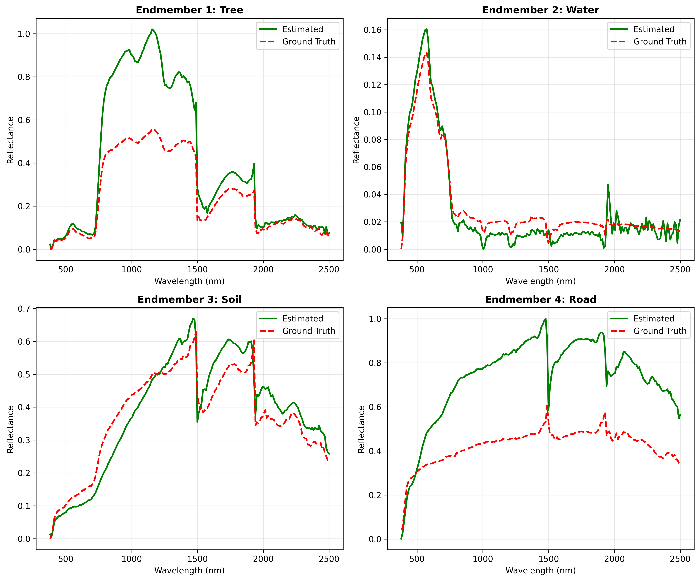
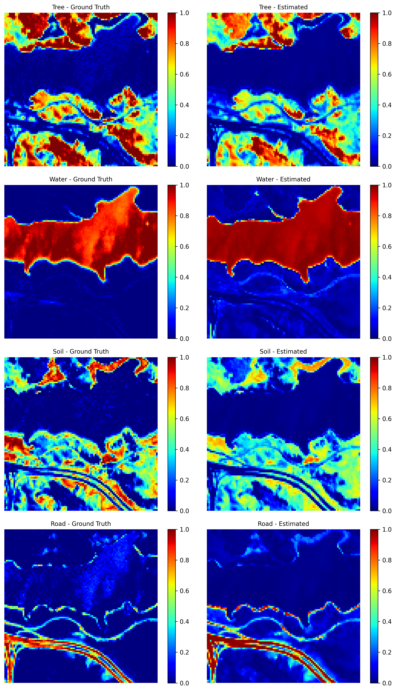

# DMTS-Net: Blind Unmixing Using Dispersion Model-Based Autoencoder

## 项目简介

本项目复现了论文《Blind Unmixing Using Dispersion Model-Based Autoencoder to Address Spectral Variability》中的DMTS-Net模型，并在Jasper Ridge高光谱数据集上进行验证。

### 核心特性

- **双流网络架构**：端元提取网络(EE Network) + 丰度估计网络(Abundance Network)
- **物理驱动模型**：基于散射模型(Dispersion Model)处理光谱变异
- **分阶段训练**：先训练EE网络，再固定权重训练丰度网络
- **完整评估**：SAD/RMSE指标 + 端元/丰度可视化


## 项目结构

```
Autoencoder/
├── data/                          # 数据目录
│   ├── jasperRidge2_R198.mat     # Jasper Ridge数据集
│   └── preprocess_report.txt     # 预处理报告
├── results/                       # 结果目录
│   ├── best_model.pth            # 最佳完整模型
│   ├── best_ee_network.pth       # 最佳EE网络
│   ├── training_log.csv          # 训练日志
│   ├── performance_metrics.txt   # 性能指标
│   ├── endmembers_comparison.png # 端元对比图
│   ├── abundance_maps.png        # 丰度分布图
│   ├── abundance_comparison.png  # 丰度对比图
│   └── endmember_matching.txt    # 端元匹配报告（检查工具输出）
├── data_preprocess.py            # 数据预处理
├── vca.py                        # VCA算法
├── dispersion_model.py           # 散射模型
├── dmts_net.py                   # DMTS-Net网络
├── loss_functions.py             # 损失函数
├── train.py                      # 训练脚本
├── evaluate.py                   # 评估脚本
├── check_endmember_order.py      # 端元顺序检查工具
├── main.py                       # 主函数
├── requirements.txt              # 依赖配置
└── README.md                     # 项目说明
```

## 可视化结果

训练和评估完成后，`results/`目录下会生成以下可视化图片：

### 1. 端元光谱对比图

展示估计端元（绿色）与真实端元（红色）的光谱曲线对比。



**文件**: `results/endmembers_comparison.png`

- 4个子图分别对应4种地物：Tree（树木）、Water（水体）、Soil（土壤）、Road（道路）
- X轴：波长（380-2500 nm）
- Y轴：反射率（0-1）
- 绿色实线：DMTS-Net估计端元
- 红色虚线：真实端元

### 2. 丰度真实值与估计值对比图

并排对比每种端元的真实丰度（左）与估计丰度（右）。



**文件**: `results/abundance_comparison.png`

- 8个子图：每种端元2张（真实 vs 估计）
- 直观展示估计精度和空间分布一致性

## 命令行参数

```
--data_dir          数据保存目录（默认：./data）
--save_dir          结果保存目录（默认：./results）
--n_bands           波段数（默认：198）
--n_endmembers      端元数（默认：4）
--K                 质量弹簧方程数（默认：3）
--batch_size        批次大小（默认：32）
--ee_epochs         EE网络训练轮数（默认：100）
--abundance_epochs  丰度网络训练轮数（默认：100）
--lr                学习率（默认：1e-4）
--mode              运行模式：train/eval/both（默认：both）
--seed              随机种子（默认：42）
--cuda/--no-cuda    是否使用GPU（默认：自动检测）
```
